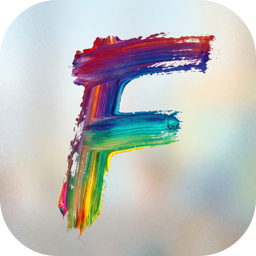

<p align="center">
  
</p>

<h1 align="center">FalMac</h1>

<p align="center">Native macOS SwiftUI app for <a href="https://fal.ai">fal.ai</a>. Paste your API key, browse the full model catalog, fill in a form that's generated <strong>from each model's own OpenAPI schema</strong>, and view/save the resulting images, video, audio, or text.</p>

<p align="center">
  
  
  
</p>

## Features

- **Liquid Glass UI** — uses the macOS 26 `glassEffect()` / `GlassEffectContainer` APIs throughout: status-tinted glass cards in the queue, `.glassProminent` Run button, glass pill for the balance chip, interactive glass thumbnails.
- **Parallel run queue** — every Run click spawns its own background polling Task and adds a card to the stack on the right. Fire as many as you want without waiting.
- **API key in Keychain** — paste once in Settings (⌘,). Never written to disk in plain text.
- **Live model catalog** — pulls from `https://api.fal.ai/v1/models`, with search, category filter, and cursor pagination.
- **Dynamic form** per model — generated from the model's OpenAPI schema (`https://fal.ai/api/openapi/queue/openapi.json?endpoint_id=...`). Handles strings, integers/numbers (with sliders when `minimum`/`maximum` are present), booleans, enums, arrays, nested objects, and `oneOf`/`anyOf`.
- **File uploads** — any URL-shaped input (e.g. `image_url`, `audio_url`) gets an "Upload file…" button that pushes to the fal CDN and pastes the resulting URL into the field.
- **Queue API with polling** — submits to `https://queue.fal.run/<endpoint_id>`, polls status, fetches the response, surfaces logs.
- **Auto media viewer** — scans the response JSON for image/video/audio URLs (extension + key-name heuristic) and renders each in the right inline viewer (image, `AVKit` video, audio scrubber).
- **One-click Download** — saves to your chosen default folder (no per-file picker) with name de-duplication, then reveals in Finder. Raw JSON response is always copyable.
- **Cancel** in-flight requests via `PUT …/cancel`.

## Build & run

### Option A — `swift run` (fastest)

```bash
cd fal-mac
swift run
```

A window opens. Use the menu **FalMac → Settings…** (or ⌘,) and paste your fal.ai key, then hit Save. The sidebar will populate.

### Option B — Real `.app` in Xcode (recommended for daily use)

```bash
open Package.swift
```

Xcode opens the Swift Package. Pick the **FalMac** scheme and the **My Mac** destination, then ⌘R. To export a distributable app, **Product → Archive**.

## Getting an API key

Sign in at <https://fal.ai/dashboard/keys> and create a key. Paste it into the app's Settings.

## Architecture

```
Sources/FalMac/
├── FalMacApp.swift         # @main App + Settings scene
├── AppState.swift          # ObservableObject: catalog, selection, form values, run state
├── FalAPI.swift            # listModels / openAPI / submit / status / result / upload
├── JSONValue.swift         # Codable union for arbitrary JSON
├── JSONSchema.swift        # $ref/oneOf-aware OpenAPI → SchemaNode flattener
├── Keychain.swift          # SecItem wrapper
├── Downloader.swift        # URLSession download + unique-name save
└── Views/
    ├── ContentView.swift   # NavigationSplitView shell
    ├── SettingsView.swift  # API key + default download folder
    ├── ModelListView.swift # sidebar with search/category/pagination
    ├── ModelFormView.swift # dynamic form generator
    └── OutputView.swift    # status, logs, media viewers, raw JSON
```

### Wire format reference

| Operation         | Method | URL                                                               |
| ----------------- | ------ | ----------------------------------------------------------------- |
| List models       | GET    | `https://api.fal.ai/v1/models?q=&category=&cursor=`               |
| Per-model schema  | GET    | `https://fal.ai/api/openapi/queue/openapi.json?endpoint_id=<id>`  |
| Submit            | POST   | `https://queue.fal.run/<endpoint_id>`                             |
| Status            | GET    | `https://queue.fal.run/<endpoint_id>/requests/<rid>/status?logs=1`|
| Result            | GET    | `https://queue.fal.run/<endpoint_id>/requests/<rid>/response`     |
| Cancel            | PUT    | `https://queue.fal.run/<endpoint_id>/requests/<rid>/cancel`       |
| Upload (token)    | POST   | `https://rest.alpha.fal.ai/storage/auth/token?storage_type=fal-cdn-v3` |
| Upload (bytes)    | POST   | `{base_url}/files/upload` with `Authorization: Bearer <token>`    |

Auth: `Authorization: Key <FAL_KEY>` on every fal-hosted endpoint.

## Notes & limits

- The dynamic form picks a single branch out of `oneOf`/`anyOf` (prefers the non-null one). For unusual shapes you can edit the JSON directly via the array/object field renderer.
- Arrays of complex objects render as a JSON textarea — paste/edit JSON directly. Simple scalar arrays are the common case for fal models (e.g. `loras`).
- The app polls every 1.5s. Long-running jobs are fine; switch the polling cadence in `AppState.run()` if needed.
- `swift run` builds an unbundled executable. For a proper code-signed `.app` with custom icon, Notification Center entitlements, or Notarization, use Xcode.

## License

MIT.
